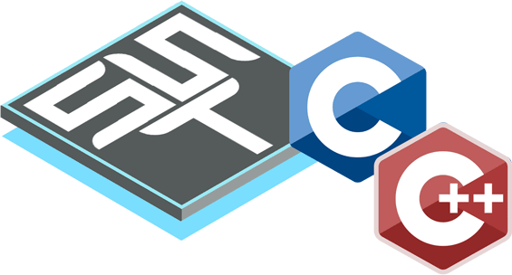
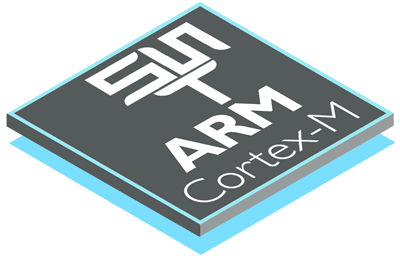
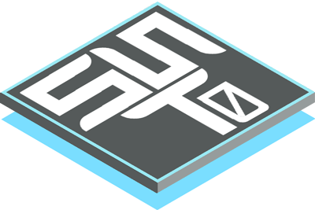
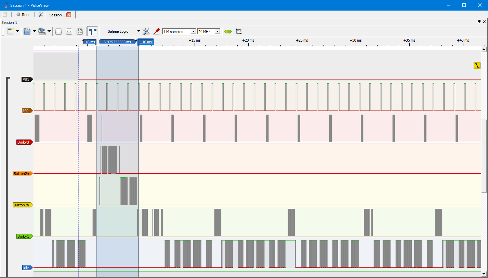
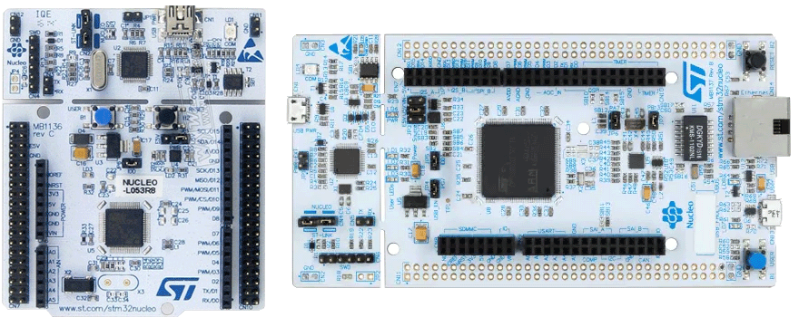

## Brought to you by:
[](https://www.state-machine.com)
<hr>

[](https://github.com/QuantumLeaps/Super-Simple-Tasker/releases/latest)
[](https://github.com/QuantumLeaps/Super-Simple-Tasker/blob/master/LICENSE)

# Super-Simple Tasker (SST)
Super-Simple Tasker (SST) is an event-driven, preemptive, priority-based
real-time operating system (RTOS) kernel that is fully compatible with
the requirements of
[Rate Monotonic Analysis/Scheduling (RMA/RMS)](https://youtu.be/kLxxXNCrY60).

<p align="center"></p>

The tasks in SST are non-blocking and run-to-completion, which are also known
as **basic tasks** in the
[OSEK/VDX Operating System Specification](https://www.irisa.fr/alf/downloads/puaut/TPNXT/images/os223.pdf). SST corresponds to the BCC2 conformance class in OSEK/VDX.
SST provides the following features:
- basic tasks (non-blocking, run-to-completion)
- preemptive, priority-based scheduling
- multiple tasks per prioriy level
- multiple "activations" per task (event queues)

> **NOTE**<br>
The execution profile of SST tasks perfectly matches the non-blocking and
run-to-completion semantics of event-driven state machines
(a.k.a. ["Active Objects" or "Actors](https://www.state-machine.com/active-object)).

This repository contains the SST following implementations:
- [preemptvie SST in C](sst_c)
- [preemptvie SST in C++](sst_cpp)

Additionally, this repository contains the even simpler, *non-preemptive*
implementation of basic tasks called [SST0](#non-preemptive-sst0):
- [non-preemptvie SST0 in C](sst0_c)
- [non-preemptvie SST0 in C++](sst0_cpp)


> **NOTE**<br>
The preemptive SST and non-preemptive SST0 implement actually *the same*
[SST API](https://github.com/QuantumLeaps/Super-Simple-Tasker/tree/main/include)
(either in C or C++).

## Hardware RTOS for ARM Cortex-M
[SST for ARM Cortex-M](sst_c/ports/arm-cm) provides a unique
**hardware implementation** of SST for ARM Cortex-M (M0, M0+, M3,
M4, M7, M23, M33). The SST "hardware RTOS" for ARM Cortex-M is fully
compatible with the requirements of
[Rate Monotonic Analysis/Scheduling (RMA/RMS)](https://youtu.be/kLxxXNCrY60).

<p align="center"></p>

> **NOTE**<br>
The SST hardware implementation is likely the most performant and efficient
**hard-real time RTOS** kernel for ARM Cortex-M.


# SST History
SST has been originally published as a cover-story article
["Build a Super-Simple Tasker"](legacy/Super-Simple-Tasker.pdf) in the
Embedded Systems Design magazine in
[July 2006](https://www.embedded.com/embedded-systems-design-july-2006).
That original version of SST (now called "Legacy SST") is
[still available](legacy) and is provided for historical reference.

Over the years, more complete SST-like kernels have been developed
for a number of embedded processors, such as: ARM Cortex-M (M0-M7),
MSP430, PIC24/dsPIC, PIC32, etc. Examples include:
[QP Real-Time Embedded Frameworks](https://www.state-machine.com/products/qp)

- [QK](https://www.state-machine.com/qpc/srs_qk.html),
which  works like SST and is available as one of the built-in kernels in the
[QP Real-Time Embedded Frameworks (RTEFs)](https://www.state-machine.com/products/qp).

- [QXK](https://www.state-machine.com/qpc/srs_qxk.html),
which combines the basic-tasks of SST with traditional blocking tasks (a.k.a.
**extended tasks** in OSEK/VDX) and is available as one of the
built-in kernels in the
[QP Real-Time Embedded Frameworks (RTEFs)](https://www.state-machine.com/products/qp)

- [QV](https://www.state-machine.com/qpc/srs_qv.html),
which works like [SST0](#non-preemptive-sst0) and is available as one
of the built-in kernels in the
[QP Real-Time Embedded Frameworks (RTEFs)](https://www.state-machine.com/products)


# Non-Preemptive SST0
This repository contains also the non-preemptive implementation of the
SST API, called **SST0**. SST0 is also a **priority-based
RTOS kernel**, but the scheduling is non-preemptive. SST0 scheduler always
executes the higest-priority basic task ready to run, but the scheduling
is performed only after every the completion of the task (run-to-completion
execution).

<p align="center"></p>

SST0 provides the following features:
- basic tasks (non-blocking, run-to-completion)
- priority-based, non-preemptive, cooperative scheduling
- only one task per prioriy level
- multiple "activations" per task (event queues)


# Getting Started / Examples
The best way to get started with SST is to build and run the provided
**examples**. This repository contains several versions of the
**"blinky-button" example**, which contains several SST tasks running
concurrently and communicating with each other. The "blinky-button" example
demonstrates **real-time** capabilities of SST and uses a logic analyzer.
(REMARK: Logic analyzer is not necessary to build and run the examples.)

<p align="center"></p>

The "blinky-button" example is provided for:
```c
Super-Simple-Tasker/
|
+---sst_c/                     // preemptive SST/C
|   +----examples/             // examples for SST/C
|   |    +----blinky_button/   // "blinky-button" example
|   |    |    +----armclang/   // project for ARM/KEIL
|   |    |    +----gnu/        // makefile for GNU-ARM
|   |    |    +----iar/        // project for IAR EWARM
|
+---sst_c/                     // preemptive SST/C++
|   +----examples/             // examples for SST/C++
|   |    +----blinky_button/   // "blinky-button" example
|   |    |    +----armclang/   // project for ARM/KEIL
|   |    |    +----gnu/        // makefile for GNU-ARM
|   |    |    +----iar/        // project for IAR EWARM
|
+---sst0_c/                    // non-preemptive SST0/C
|   +----examples/             // examples for SST0/C
|   |    +----blinky_button/   // "blinky-button" example
|   |    |    +----armclang/   // project for ARM/KEIL
|   |    |    +----gnu/        // makefile for GNU-ARM
|   |    |    +----iar/        // project for IAR EWARM
|
+---sst0_cpp/                  // non-preemptive SST0/C++
|   +----examples/             // examples for SST0/C++
|   |    +----blinky_button/   // "blinky-button" example
|   |    |    +----armclang/   // project for ARM/KEIL
|   |    |    +----gnu/        // makefile for GNU-ARM
|   |    |    +----iar/        // project for IAR EWARM
|
```
For **every** of these cases the examples are built for the following
embedded boards:

<p align="center"></p>

- **STM32 NUCLEO-L053R8** (ARM Cortex-M0+)
- **STM32 NUCLEO-H743ZI** (ARM Cortex-M7 with double-precision FPU)

# Licensing
The SST source code and examples are released under the terms of the
permissive [MIT open source license](LICENSE). Please note that the
attribution clause in the MIT license requires you to preserve the
original copyright notice in all changes and derivate works.


# Invitation to Collaborate
**This project welcomes collaboration!** Please help to improve SST,
port it to other processors, integrate it with other embedded software,
add interesting examples, etc. To avoid fragmentation, this repository is
intended to remain the home of SST. To contribute, please clone, fork,
and submit **pull requests** to incorporate your changes.


# How to Help this Project?
If you like this project, please **spread the word** about SST on various
forums, social media, and other venues frequented by embedded folks!

<p align="center"></p>

Also, please give [this repository](https://github.com/QuantumLeaps/Super-Simple-Tasker)
a star (in the upper-right corner of your browser window)

<p align="center"></p>

