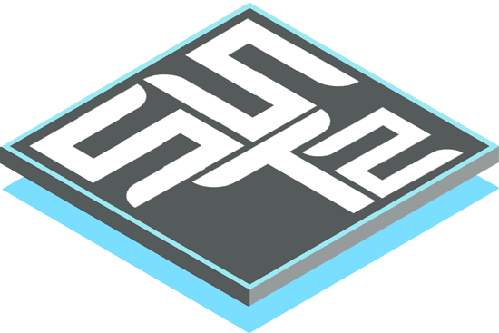
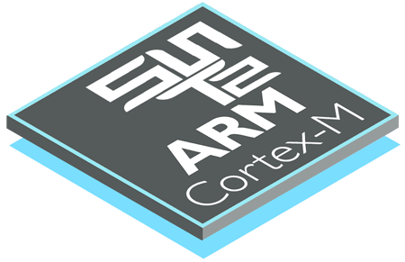

## Brought to you by:

# Super-Simple Tasker (SST) Version 2
Super-Simple Tasker (SST) is a **preemptive, priority-based RTOS kernel**
fully compatible with the requirements of [Rate Monotonic Analysis/Scheduling
(RMA/RMS)](https://youtu.be/kLxxXNCrY60).
This repository contains the **modern version of SST** (version 2).

# Hardware RTOS for ARM Cortex-M
SST version 2 provides a unique **hardware implementation**
of the preemptive, priority-based RTOS kernel for all ARM Cortex-M CPUs
(M0, M0+, M3, M4, M7, M23, M33).

> **NOTE** 
SST is likely the most performant and efficient **hard-real time RTOS**
kernel for ARM Cortex-M.

# History
SST has been originally published as a cover-story article
["Build a Super-Simple Tasker"](sst1/Super-Simple-Tasker.pdf) in the
Embedded Systems Design magazine in
[July 2006](https://www.embedded.com/embedded-systems-design-july-2006).
That original version of SST (now called SST1) is [still available](sst1)
and is provided for historical reference.

Over the years, more mature and complete SST-like kernels have been
developed for a number of embedded processors, such as: ARM Cortex-M (M0-M7),
MSP430, PIC24/dsPIC, PIC32, etc. Examples include:
- [QK ("Quantum Kernel")](https://www.state-machine.com/qpc/srs_qk.html),
which  works exactly like SST and is integrated with the
[QP Real-Time Embedded Frameworks (RTEFs)](https://www.state-machine.com/products).

- [QXK ("Quantum Extended Kernel")](https://www.state-machine.com/qpc/srs_qxk.html),
which combines the basic-tasks of SST with traditional blocking threads.

# Licensing
The SST source code and examples are released under the terms of the
permissive [MIT open source license](LICENSE). Please note that the
attribution clause in the MIT license requires you to preserve the
original copyright notice in all changes and derivate works.

# Please Contribute!
**This project welcomes collaboration!** Please help to improve SST,
port it to other processors, integrate it with other embedded software,
add interesting examples, etc. To avoid fragmentation, this repository is
intended to remain the home of SST. To contribute, please clone, fork,
and submit **pull requests** to incorporate your changes.

# How to Help this Project?
If you like this project, please **spread the word** about SST on various
forums, social media, and other venues frequented by embedded folks!

Also, please give [this repository](https://github.com/QuantumLeaps/Super-Simple-Tasker)
a star (in the upper-right corner of your browser window)

